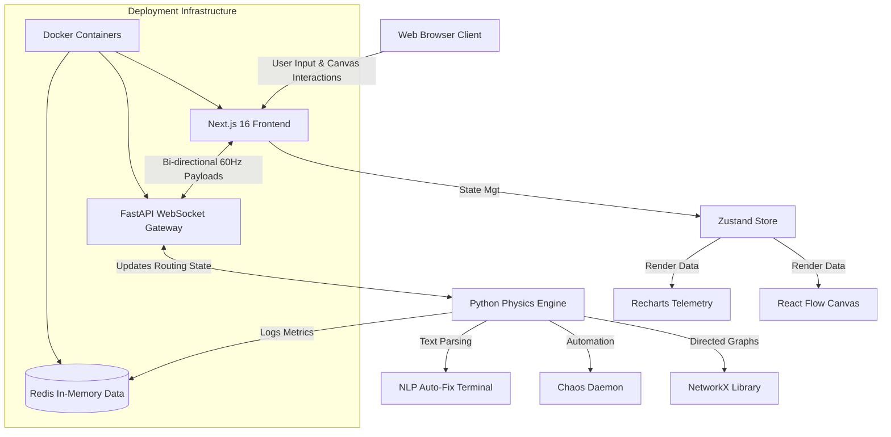

# 1. Vision Document

### Project Name & Overview
**Project Name:** NetworkSim
**Overview:** NetworkSim is a high-fidelity, real-time web application designed to simulate the physics, traffic flow, and failure states of massive distributed network architectures. It provides a visual, interactive canvas where users can build, monitor, and deliberately test complex microservice environments under simulated duress.

### Problem it Solves
Modern cloud computing and distributed systems are highly complex, making it difficult for students, network engineers, and system architects to visualize real-time packet flow, latency, and system resilience without provisioning expensive, live AWS infrastructure. NetworkSim bridges this gap by providing a risk-free, highly accurate physical model of network behaviors, including automated failure injection and real-time cost tracking, allowing users to understand the financial and technical impacts of architectural decisions.

### Target Users (Personas)
* **The System Architect (Senior User):** Needs to prototype network topologies and validate High Availability (HA) designs before proposing them to stakeholders. Values accurate telemetry and latency visualization.
* **The SRE / Cloud Engineer:** Uses the application to inject failure (Chaos Engineering) and test how effectively an architecture self-heals or routes around degraded nodes.
* **The Computer Science Student:** Requires a sandbox environment to learn about distributed systems, load balancing, and network traversal algorithms without incurring real-world cloud computing bills.

### Vision Statement
To democratize the understanding of complex distributed systems by providing an accessible, mathematically rigorous, and highly interactive simulation environment that seamlessly visualizes network traffic, architectural failures, and cloud computing costs in real-time.

### Key Features / Goals
* **Interactive Architecture Canvas:** A drag-and-drop React Flow interface for building custom network topologies.
* **Real-Time Physics Engine:** A Python-based (NetworkX) high-speed simulator calculating latency, bandwidth bottlenecks, and edge costs at 60 ticks per second.
* **Chaos Daemon:** An automated sub-system that selectively degraded or destroys nodes to test system resilience and routing intelligence.
* **Live Telemetry & Gamified Billing:** Recharts-powered analytics for real-time monitoring of theoretical resource consumption and AWS costs.
* **NLP Auto-Fix Terminal:** A command-line interface that utilizes natural language processing to diagnose and automatically repair degraded network architecture.

### Success Metrics
* **Simulation Fidelity:** The physics engine must consistently process and broadcast 60 ticks per second (60Hz WebSocket payload rate) with under 50ms latency.
* **User Engagement:** Users successfully building and simulating a 20+ node architecture within 15 minutes of first login.
* **System Stability:** Zero dropped WebSocket connections over a continuous 1-hour heavy stress test simulation.

### Assumptions & Constraints
* **Assumption:** Client machines have modern browsers capable of rendering complex SVG/HTML5 canvas elements via React Flow without significant frame-drops.
* **Constraint:** The simulation is confined to theoretical data, meaning it simulates network physics mathematically rather than shifting actual TCP/IP payload data across the user's local network hardware.
* **Constraint:** Real-time WebSocket architecture may face firewall restrictions on certain high-security university or corporate networks.

# 2. User Stories

1. As a System Architect, I want to drag and drop different service nodes (e.g., Database, Server, Cache) onto a canvas so that I can quickly map out a server topology.
2. As a System Architect, I want to connect nodes with directed edges so that I can define the permitted flow of traffic between services.
3. As a System Architect, I want to assign custom latency and bandwidth constraints to specific network edges so that I can simulate degraded geographic connections.
4. As a Student, I want to click a "Start Simulation" button so that I can see visualizing traffic packets flowing across my created network.
5. As an SRE, I want to manually click a node and set its state to "Offline" so that I can see how the network re-routes traffic.
6. As an SRE, I want to activate the Chaos Daemon so that random nodes and edges fail automatically, simulating unpredictable cloud outages.
7. As a System Architect, I want to see a live graph of network throughput so that I can identify bottlenecks in my topology.
8. As a Student, I want to view a real-time tracking dashboard of simulated AWS computing costs so that I understand the financial impact of over-provisioning servers.
9. As a Student, I want to be alerted when a node reaches maximum traffic capacity so that I can learn about bottlenecking and load balancer requirements.
10. As a System Architect, I want to select a group of nodes and define them as a single Availability Zone tightly coupled geographically.
11. As an SRE, I want the NLP Auto-Fix Terminal to accept commands like "repair all database nodes" so I can rapidly restore architecture without clicking manually.
12. As an SRE, I want the NLP Terminal to explain why a node failed when I type "diagnose [NodeID]" so that I understand the cascading failures.
13. As a System Architect, I want to save my current canvas topology to a local file so that I can reload the scenario later.
14. As a System Architect, I want to load a pre-configured "Standard E-Commerce Setup" template so that I do not have to build basic architectures from scratch.
15. As a Student, I want the frontend to display traffic packet drops as red visual animations so that I clearly see data loss occurring.
16. As a System Architect, I want to define load balancers that utilize Round-Robin algorithms so that I can disperse traffic across multiple backend nodes.
17. As a System Architect, I want to define load balancers using Least-Connection algorithms so that I can compare algorithmic efficiency.
18. As a User, I want to zoom in and zoom out of the canvas so that I can manage massive architectures involving hundreds of nodes.
19. As an SRE, I want the system to calculate the theoretical end-to-end latency of a request from User Node to Database Node so I can optimize speed.
20. As a Student, I want a modal to pop up explaining the difference between TCP and UDP when I configure an edge connection.
21. As a System Architect, I want a central dashboard showing the historical uptime percentage of all nodes during a running simulation.
22. As an SRE, I want the Chaos Daemon to have a configurable "Aggression Level" so I can toggle between mild packet loss and catastrophic region failure.
23. As a User, I want the application to automatically toggle dark mode based on my system OS settings to reduce eye strain.
24. As a Developer, I want WebSocket connection status to clearly display in the header so I know if I have lost sync with the Python backend.
25. As a System Architect, I want to export my analytics data as a CSV file after a simulation run for external report generation.

# 3. MoSCoW Prioritization & Wireframe Flow

### MoSCoW Prioritization

* **Must Have:** Drag-and-drop canvas layout, Edge definitions (connections), Live physics simulation engine (Python backend), WebSocket telemetry pipe, Basic node state toggling (Online/Offline).
* **Should Have:** Chaos Daemon automation, Recharts telemetry visualizations, AWS Capital Tracking integration, Save/Load topology features.
* **Could Have:** NLP Auto-Fix Terminal, Advanced routing algorithms (Least-Connection), CSV Data Export, Pre-built templates.
* **Won't Have (This Iteration):** Multi-player collaborative network drawing, Real-time voice chat integration, Mobile responsive view (Canvas requires desktop screen real estate).

### Wireframe Flow (6 Key UI Screens)

1. **Welcome / Landing Dashboard**
   * Structural Layout: Centered Hero section with a "New Simulation" button. A split view below offering "Load Existing Topology" or "Select Template".
2. **Main Simulation Canvas (The Core App)**
   * Structural Layout: Left-hand side vertical toolbar containing drag-and-drop node primitive icons. Center screen is the expansive, grid-backed React Flow canvas. Top horizontal header contains control buttons (Play, Pause, Stop Simulation).
3. **Node Configuration Inspector**
   * Structural Layout: A dynamic right-side sliding panel that appears when a user clicks a node. Contains input fields for Name, Type, Traffic Capacity, and a red "Kill Node" button for manual failure injection.
4. **Telemetry & Analytics Overlay**
   * Structural Layout: A translucent Recharts overlay living in the bottom-left of the main canvas. Displays a continuously updating line graph representing total network throughput and packet loss.
5. **Cost / Capital Tracking Modal**
   * Structural Layout: A center-pop modal triggered by a top-nav button. Displays a table breakdown of active nodes, their theoretical hourly AWS cost, and a large, calculating total budget figure at the bottom.
6. **NLP Auto-Fix Terminal Console**
   * Structural Layout: A dark-themed, expandable drawer at the very bottom of the screen (resembling VS Code terminal). Features a single command-line input and a scrolling log of system events and NLP responses.

# 4. Architecture Diagram



# 5. Dev Setup Guide

### .gitignore File
```text
node_modules/
.next/
out/
build/
.env
.env.local
.env.development.local
.env.test.local
.env.production.local
.DS_Store
*.pem
__pycache__/
*.pyc
.pytest_cache/
venv/
env/
.devcontainer/
logs/
```

### GitHub Flow Branching Strategy
The project follows a strict feature-branch workflow. The `main` branch serves as the immutable source of truth and must always contain highly stable, production-ready code. Developers are not permitted to commit directly to `main`. When starting a new task, a developer pulls the latest `main` code and creates a new branch named `feature/description` or `bugfix/description`. Once development and local testing are complete, the developer opens a Pull Request (PR) merging into `main`. This PR requires review and approval from at least one peer. All continuous integration tests (Jest, PyTest) must pass as part of the PR checks before the merge is executed.

### Quick Start – Local Development

**Dockerfile (Backend FastAPI Example)**
```dockerfile
FROM python:3.11-slim
WORKDIR /app
COPY requirements.txt .
RUN pip install --no-cache-dir -r requirements.txt
COPY . .
EXPOSE 8000
CMD ["uvicorn", "app.main:app", "--host", "0.0.0.0", "--port", "8000", "--reload"]
```

**docker-compose.yml**
```yaml
version: '3.8'
services:
  frontend:
    build: 
      context: ./frontend
    ports:
      - "3000:3000"
    environment:
      - NEXT_PUBLIC_WS_ENDPOINT=ws://localhost:8000/ws
    volumes:
      - ./frontend:/app
      - /app/node_modules

  backend:
    build:
      context: ./backend
    ports:
      - "8000:8000"
    volumes:
      - ./backend:/app
    environment:
      - REDIS_URL=redis://redis:6379

  redis:
    image: "redis:alpine"
    ports:
      - "6379:6379"
```

### Mock Terminal CLI Example

```text
user@dev-machine:~/NetworkSim$ docker-compose up --build
[+] Building 2.3s (15/15) FINISHED                                                                      
 => [frontend internal] load build definition from Dockerfile                                      0.0s
 => => transferring dockerfile: 32B                                                                0.0s
 => [backend internal] load build definition from Dockerfile                                       0.0s
...
[+] Running 4/4
 ✔ Network redis      Created                                                                      0.1s 
 ✔ Container redis    Started                                                                      0.3s 
 ✔ Container backend  Started                                                                      0.4s 
 ✔ Container frontend Started                                                                      0.5s 

frontend  | ready started server on 0.0.0.0:3000, url: http://localhost:3000
backend   | INFO:     Uvicorn running on http://0.0.0.0:8000 (Press CTRL+C to quit)
backend   | INFO:     Started websocket handler... Ready for 60-tick payloads.
frontend  | event - compiled client and server successfully in 1250 ms (145 modules)

user@dev-machine:~/NetworkSim$ curl -I http://localhost:3000
HTTP/1.1 200 OK
X-Powered-By: Next.js
Content-Type: text/html; charset=utf-8
Connection: keep-alive
```
