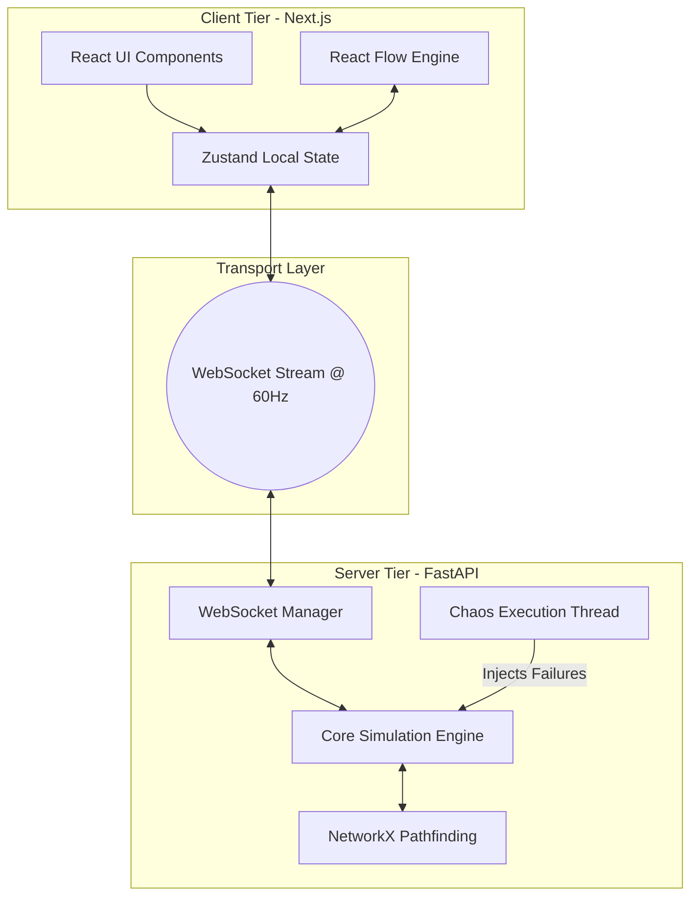

# 1. Design Principles

**Abstraction:** NetworkSim uses abstraction extensively by hiding the complex mathematical routing calculations inside the `NetworkX` library in the Python backend. The frontend Next.js application knows nothing about how a shortest-path algorithm is calculated; it merely passes a payload requesting route data and receives an abstracted array of nodes to animate.

**Modularity:** The system is heavily modularized across both the frontend and backend. In the backend, the Chaos Daemon, the Routing Engine, and the WebSocket broadcaster are completely distinct services. In the frontend, React components are atomized. For instance, `AnalyticsPanel`, `CostModal`, and `EventConsole` operate independently, allowing developers to upgrade the analytic charting logic without breaking the simulation canvas.

**Cohesion:** Cohesion dictates that components with closely related responsibilities should remain grouped. The `Zustand` store on the frontend serves as a highly cohesive state container. All UI nodes, edges, application modes, and telemetry data exist in specialized slices within a single centralized store, preventing state logic from bleeding indiscriminately across React visual components.

**Low Coupling:** The FastAPI backend and the Next.js frontend exhibit exceptionally low coupling. They are mutually agnostic and communicate exclusively via JSON over WebSockets. The frontend is fully decoupled from the physical simulation engine; if the python simulation engine was rewritten in Rust or Go, the Next.js frontend would require absolutely zero modifications as long as the WebSocket payload contract remains identical.

# 2. High-Level Architecture

The primary architectural style utilized by NetworkSim is a **Client-Server Architecture augmented with Bi-Directional WebSockets and an Event-Driven Subsystem.**

**Justification:** A traditional REST API architecture is entirely insufficient for a physics-based simulation. Request-response cycles overhead would cause crippling lag when attempting to update hundreds of nodes 60 times a second. By leveraging WebSockets, an open TCP stream is maintained, allowing the Python Engine to broadcast asynchronous generator yields instantly to the client. This architectural style was explicitly chosen to guarantee the sub-50ms latency required for the "gamified" real-time feel of the React Flow canvas.

### High-Level Architecture Diagram

# 3. User Interface Design

The UI for NetworkSim is constructed around the central philosophy of maximizing usable canvas space while ensuring telemetry data is highly visible but non-intrusive.

* **Welcome Area:** Designed to be frictionless. Immediate calls to action prevent users from getting bogged down in setup wizards.
* **Main Canvas:** The crux of the UI. Focuses on spatial layout. Visually distinguishes node health through standardized color coding (Green: Healthy, Amber: High Load, Red: Offline).
* **Inspector Panel:** Utilizes a slide-out approach rather than pop-up modals to prevent obscuring the active topology while an engineer is fine-tuning node parameters.
* **Telemetry Overlay:** Housed in a glassmorphic (translucent) container in the corner of the screen. Ensures the user can monitor global system health without losing sight of the underlying network wiring.
* **Cost Matrix Modal:** Unlike the inspector, financial data requires absolute focus. This takes over the center screen to ensure the user is actively acknowledging their simulated infrastructure budget.
* **NLP Auto-Fix Console:** Modeled explicitly after familiar developer environments (like the VS Code terminal). Its position at the bottom of the screen leverages muscle-memory for developers accustomed to typing commands horizontally under their workspace.

# 4. Design Decisions & Why

1. **Selection of Next.js with Turbopack:** Chosen over standard Create React App or Vite to leverage built-in API routing capabilities for initial auth and standard REST endpoints, alongside Turbopack for significantly faster hot-module reloading during intensive UI development.
2. **Selection of Zustand over Redux:** Redux introduces extensive boilerplate and forces a strict rendering lifecycle that can bottleneck UI updates when dealing with hundreds of actively morphing node objects. Zustand provides naked, unopinionated, high-performance state binding directly to the React Flow instance.
3. **Python NetworkX for the Physics Engine:** Pathfinding in massive directed graphs is mathematically intensive. Python's NetworkX is an industry standard pre-optimized for graph theory. Re-implementing Dijkstra’s algorithm in JavaScript on the frontend would invariably freeze the browser's main thread.
4. **Asynchronous Generators for WebSocket Payloads:** Standard synchronous Python blocks while calculating. Using `asyncio` and `yield` ensures that the server can calculate tick `N+1` while simultaneously broadcasting tick `N` over the network socket, ensuring the 60Hz guarantee.
5. **Event-Driven Chaos Daemon:** Implementing the Chaos Daemon as a separate asynchronous task loop rather than weaving it into the main calculation loop ensures that randomized failure injections never delay the core physics tick rate.

# 5. Maintainability

NetworkSim is engineered for longevity and horizontal scaling. 
* **Type Safety:** The frontend relies strictly on TypeScript, providing massive maintainability benefits by ensuring payload contracts from the backend are validated at compile time, eliminating runtime undefined errors on node properties.
* **Containerization:** Full Docker support guarantees that 'works on my machine' syndrome is eradicated, severely lowering the barrier to entry for open-source contributors.
* **Decoupled Engine:** The routing logic is isolated from the data transmission layer in FastAPI. If traffic models need to become more sophisticated (e.g., modeling BGP routing instead of direct point-to-point), the NetworkX topology maps can be modified without altering a single line of WebSocket or Next.js code.
* **Scalability:** The architecture permits horizontally scaling the FastAPI WebSocket pods and utilizing a Redis Pub/Sub backplane to synchronize state across multiple backend instances if the simulation load becomes too vast for a single threaded loop.
