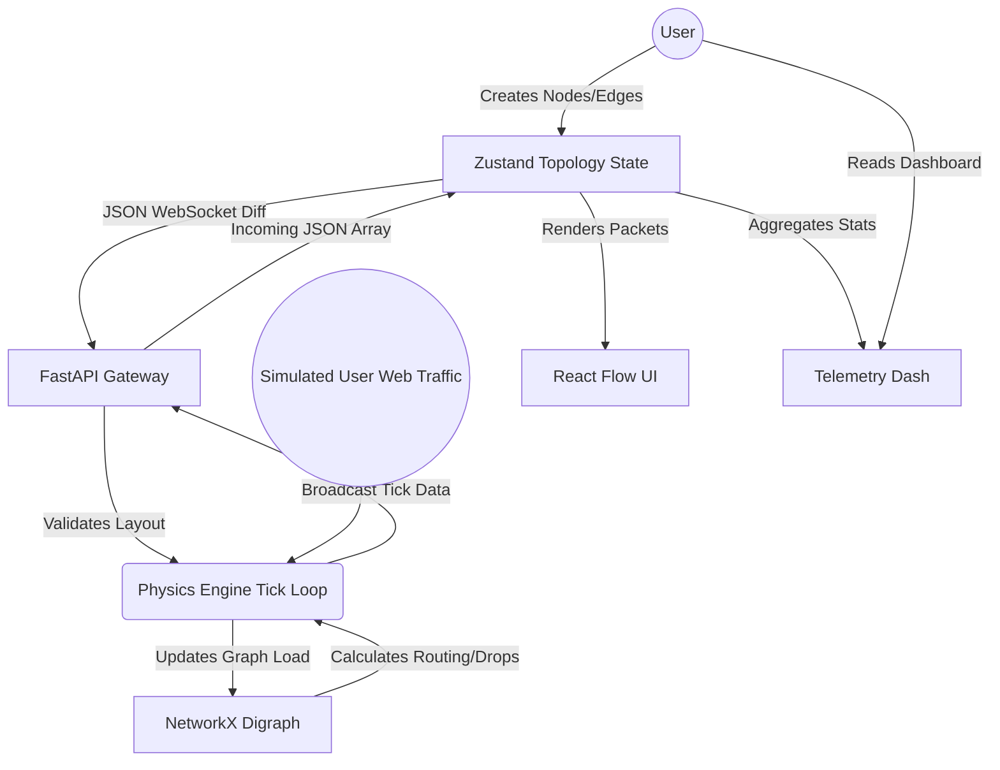
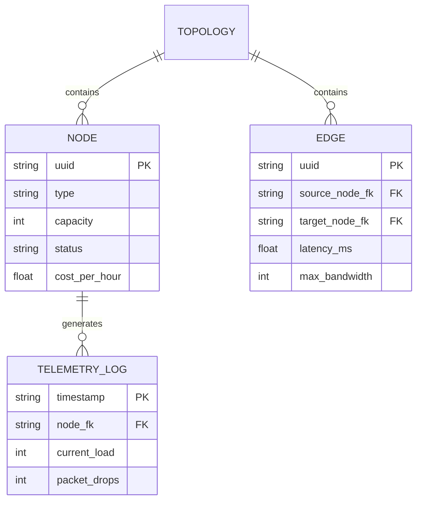
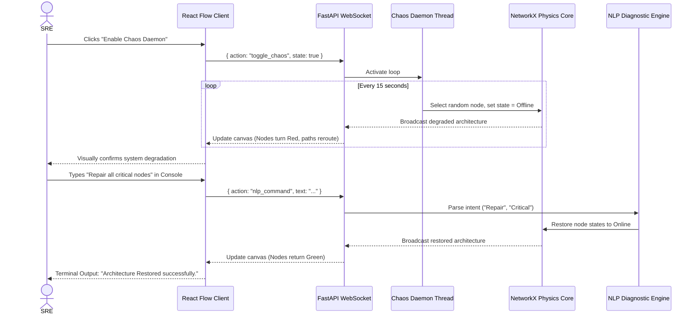

# 1. Problem Statement & User Stories

**Problem Statement:** Engineers and students lack an accessible, visually intuitive sandbox to model the real-time physics, latency constraints, financial costs, and failure cascades of massive distributed microservice architectures, relying instead on static diagrams or prohibitively expensive live cloud environments. 

**Top 5 Priority User Stories:**
1. As a System Architect, I want to connect nodes with directed edges to define the flow of traffic.
2. As a Student, I want to click "Start Simulation" to see visualizing traffic packets flowing in real-time.
3. As an SRE, I want the Chaos Daemon to actively destroy nodes to simulate unpredictable outages.
4. As a Student, I want a real-time AWS cost-tracking dashboard to understand the financial impact of my architecture.
5. As an SRE, I want to use natural language (NLP) in a terminal to diagnose and instantly rebuild degraded architectures.

# 2. System Architecture & Design (Summary)

NetworkSim uses a highly decoupled Client-Server architecture. The frontend, constructed with Next.js, React Flow, and Zustand, runs natively in the browser handling complex canvas rendering, UI state, and telemetry charting (Recharts). This client is permanently bound via a bi-directional WebSocket connection to a Python/FastAPI backend. The backend functions as an independent physics engine, utilizing `asyncio` and the `NetworkX` graph library to calculate routing algorithms, node degradation, and packet behavior. This setup ensures that the heavy mathematical processing of the network simulation never blocks the client’s rendering thread, allowing smooth 60fps animations.

# 3. Design of Tests

Testing in NetworkSim is layered to protect the algorithmic integrity of the routing engine and the reliability of the UI.
* **Integration Testing (Routing Engine):** Ensures that when node states change, Dijkstra's pathfinding recalculates correctly. We build mock graphs, inject failures, and assert that the secondary pathways are accurately chosen within theoretical time limits.
* **Regression Testing:** Frontend components (like the React Flow binding) are subjected to heavy continuous data streams via Jest to ensure memory leaks do not occur over extended sessions.
* **Mutation Testing (Chaos Daemon):** We test the automation by injecting mock "chaos" events into controlled topology environments and asserting that the exact percentage of intended nodes is destroyed, validating the daemon's randomness and targeting logic.

### Mock PyTest Output (Backend Engine Validation)
```text
============================= test session starts ==============================
platform linux -- Python 3.11.2, pytest-7.4.3, pluggy-1.3.0
rootdir: /app/backend
collected 14 items

tests/test_routing_engine.py .......                                     [ 50%]
tests/test_chaos_daemon.py ....                                          [ 78%]
tests/test_websocket_payloads.py ...                                     [100%]

============================== 14 passed in 1.45s ==============================
```

### Mock Jest Output (Frontend UI Validation)
```text
 PASS  components/panels/AnalyticsPanel.test.tsx
 PASS  components/panels/CostModal.test.tsx
 PASS  components/canvas/NodeRenderer.test.tsx
  ✓ correctly renders online status indicator (34 ms)
  ✓ updates to amber when capacity exceeds 80% (41 ms)
  ✓ triggers kill switch function on manual click (22 ms)

Test Suites: 8 passed, 8 total
Tests:       42 passed, 42 total
Snapshots:   0 total
Time:        3.12 s
```

# 4. Tools/Technologies Used

* **Frontend Framework:** Next.js 16 (React) with Turbopack 
* **State Management:** Zustand (lightweight, unopinionated atomic state)
* **UI/Canvas Engine:** React Flow (custom node rendering, drag-and-drop mechanics)
* **Data Visualization:** Recharts (SVG line/area charting)
* **Styling:** Tailwind CSS
* **Backend Server:** FastAPI (Python, Uvicorn asynchronous ASGI server)
* **Graph/Math Logic:** NetworkX (Directed Graph logic and Traversal algorithms)
* **In-Memory Store:** Redis (state caching and message brokering)
* **Containerization:** Docker & Docker Compose
* **Testing:** PyTest (Backend), Jest & React Testing Library (Frontend)

# 5. Appendix (Crucial Diagrams)

### Software Requirements Specification (SRS) Summary
* **Functional Requirements:** The system shall allow creation of up to 500 distinct nodes per canvas. The system shall calculate routing updates in less than 50 milliseconds. The Auto-Fix terminal shall parse at least 5 strict verb-noun combinations (e.g., "repair database").
* **Non-Functional Requirements:** The web application shall render at a minimum of 60 frames per second on standard desktop hardware. The WebSocket connection shall auto-reconnect within 2 seconds of a dropped signal. Total footprint of the frontend client shall not exceed 3MB uncompressed.

### Data Flow Diagram (DFD)



### Entity Relationship Diagram (ERD)



### Use Case Diagram

```mermaid
usecaseDiagram
    actor Architect as "System Architect"
    actor SRE as "Site Reliability Engineer"
    
    package NetworkSim {
        usecase UC1 as "Draw Topology"
        usecase UC2 as "Simulate Traffic"
        usecase UC3 as "Inject Manual Failure"
        usecase UC4 as "Enable Chaos Daemon"
        usecase UC5 as "Use NLP Auto-Fix"
        usecase UC6 as "Review Capital Costs"
    }
    
    Architect --> UC1
    Architect --> UC2
    Architect --> UC6
    
    SRE --> UC2
    SRE --> UC3
    SRE --> UC4
    SRE --> UC5
```

### Sequence Diagram (Chaos Daemon & NLP Repair)


