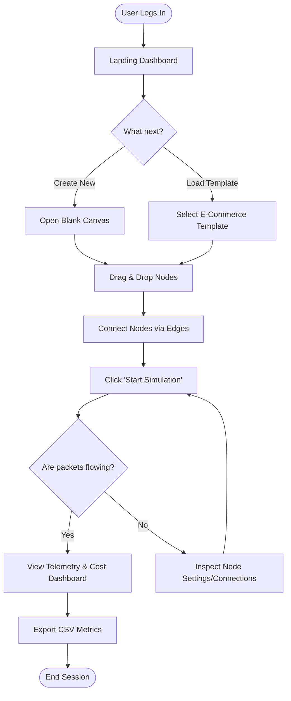
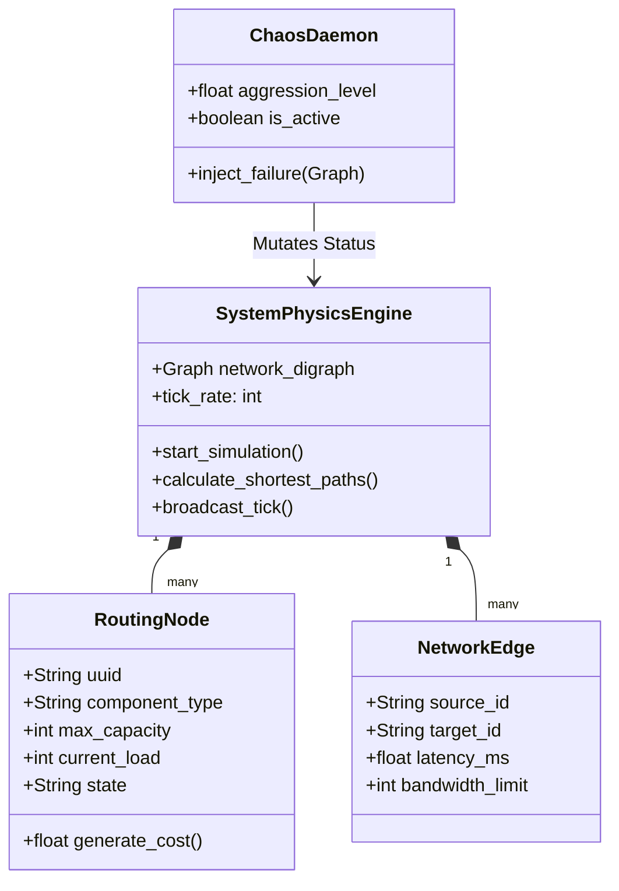
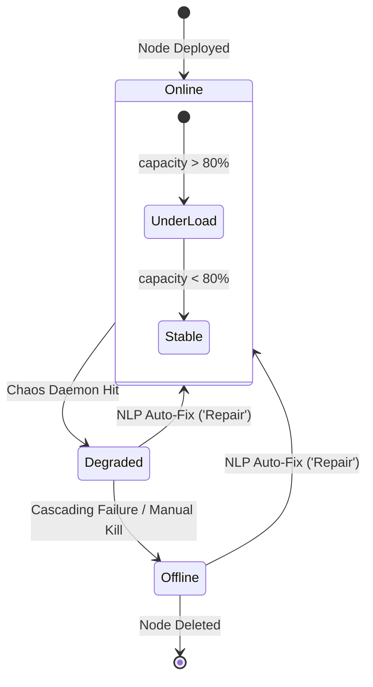
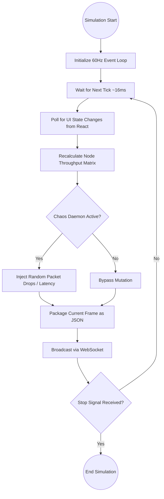
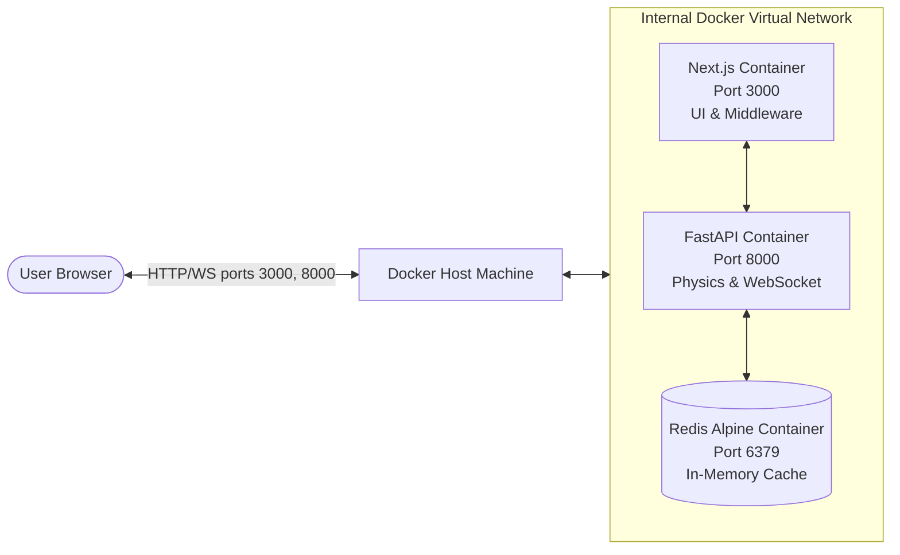

# Supplemental Project Diagrams

*(You can copy and paste the `mermaid` code blocks below into your DA Word documents, or render them directly in your Markdown viewer.)*

---

## Digital Assignment 1 (DA1)

### 1. User Journey Flowchart
**Purpose:** Maps out the step-by-step experience of a System Architect logging in and creating a simulation. Perfect for your UI flow documentation in DA1.

---

## Digital Assignment 2 (DA2)

### 2. Domain Class Diagram
**Purpose:** Illustrates the fundamental data structures and classes powering the NetworkSim application. Excellent for explaining Object-Oriented principles and modularity in DA2.

### 3. Node State Machine Diagram
**Purpose:** Demonstrates the possible operational states a structural node can exist within during a simulation run. Ideal for backend design explanations.

---

## Digital Assignment 3 (DA3)

### 4. 60Hz Engine Activity Flow
**Purpose:** Outlines the core cyclical execution thread that allows the Python physics engine to function asynchronously. Great for your Systems Architecture and Test section.

### 5. Docker Deployment Orchestration Diagram
**Purpose:** Shows how the separated containers execute securely on the host machine to deliver the full application, proving your deployment strategy.

