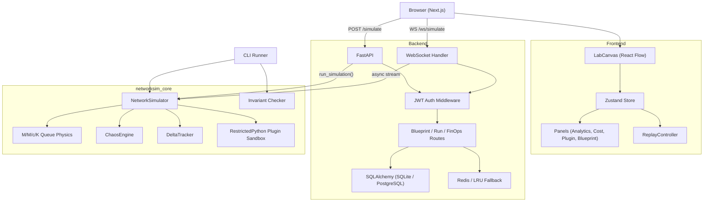

# Architecture

## System Overview



## Data Flow

1. User builds a topology on the canvas (nodes + edges stored in Zustand)
2. Simulation starts via WebSocket -- graph is serialized and sent to the backend
3. Backend validates the graph, creates a `NetworkSimulator`, and streams tick deltas back
4. Each tick: physics evaluates M/M/c/K queuing per node, chaos engine may fail nodes, plugins run in sandbox, delta tracker computes diffs
5. Frontend receives deltas, updates store, renders charts and node states
6. After completion, ReplayController allows scrubbing through tick history with sub-tick interpolation

## Key Directories

```
flightsim/
  app/                  Next.js app directory (pages, layout)
  components/           React components (canvas, panels, telemetry, auth)
  lib/                  Zustand store, auth helpers
  backend/
    app/                FastAPI application (routes, models, auth, cache, db)
  networksim_core/      Pip-installable simulation engine library
    src/networksim/
      engine/           Simulator, physics, chaos, delta tracker
      plugins/          RestrictedPython sandbox
      invariants/       YAML rule loader, AST checker, reporters
      tracing/          W3C trace span generator
  cli/                  CLI runner (networksim command)
  examples/             Sample blueprints and invariant rules
  docs/                 Architecture documentation
```
